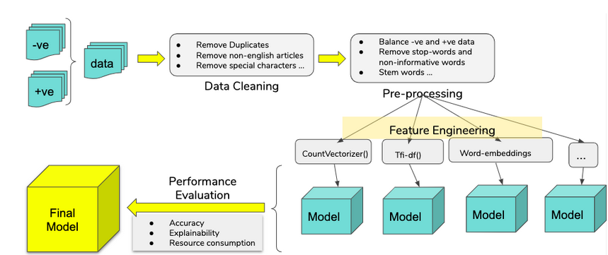

**Data**

The data for this project were collected by our partner organization, Global Disinformation Index (GDI), and consist of legitimate news articles and content identified to contain disinformation related to the novel coronavirus. The data were scraped from the internet using the software Veracity and provided to us in two separate .csv files:

    (1) articles labeled as containing disinformation

    (2) articles labeled as legitimate news articles 

All samples are related to the novel coronavirus and were published between March and June 2020. Before any quality control processes, the disinformation dataset consisted of 20,172 articles and the legitimate dataset included 14,278 articles. 

The Global Disinformation Index also provided a separate corpus that was used to train word embeddings. This corpus (1.3 GiB) contained over 574,000 unlabeled articles about coronavirus. We chose to train word embeddings on this separate corpus in order to ensure that our model would learn from a set of articles it has never seen thereby minimizing overfitting.

**Tools (aka “component specification”)**

In order to prepare the data for modelling, we did the following:

    1. Removed all duplicates in the article text column (i.e. any articles that had exactly the same text).

    2. Removed any observations which were missing the article text.

    3. Removed all non-English articles. 

    4. Identified all embedded hyperlinks and replaced them with ‘HTMLEMBD’. 

    5. Tokenized article text. 

The following packages were used in data processing, feature engineering and modelling stages of the project:  NLTK, Pandas, SciPy, SpaCy,  Keras, TensorFlow, numpy, matplotlib and sklearn. We also used other libraries to train our word embeddings in Glove and Word2Vec. These libraries are Fasttext and Gensim libraries respectively. The outcomes from these approaches were saved in text files which were referenced in our word embedding model.

**Processes**

We conducted some exploratory analyses on the data using Jupyter Notebooks. These analyses included descriptive and summary statistics as well as data visualizations. 

In order to prepare the data for natural language processing analysis, we performed a series of data quality checks and filtering. First, we combined the two datasets into one. Next, we removed all duplicates in the article text column (i.e. any articles that had exactly the same text) as well as any observations which were missing the article text. We then used the Language-Detection library in Python to identify and remove any non-English articles. 

After basic data quality checking described above, we conducted a series of preprocessing steps to further prepare the text data, in turn getting it ready for machine learning. The steps for preparing the data evolved iteratively as we gained more understanding of the models and their requirements. The primary preprocessing steps that we used were:

* Tokenizing (breaking sentences/phrases into individual words)
* Removing stop words (words that don't add much meaning to a sentence, such as 'the', 'that', 'a')
* Word embeddings (creating mathematical vector representations of words)

Next, we extracted hand-crafted features from the text data using further data processing methods. We extracted both linguistic and semantic features (i.e. average sentence length, average use of nouns) as well as text representation features (where each word is transformed into mathematical vector). A different process is required to extract each type, with NLP used for the latter and some form of word embeddings (Word2Vec, Bag of Words, used for the latter). 

The following diagram captures the overall workflow of this project, starting with data cleaning and processing and culminating in selection of the final model. Once the data was prepared and preprocessed, it was divided into train and test data. While training the model, the train data was also used to cross-validate the model to make sure that the chosen model had the highest performance. Finally, the performance of a model was evaluated by how well it was able to predict disinformation from legitimate articles in the data that had been set aside for testing.

 
