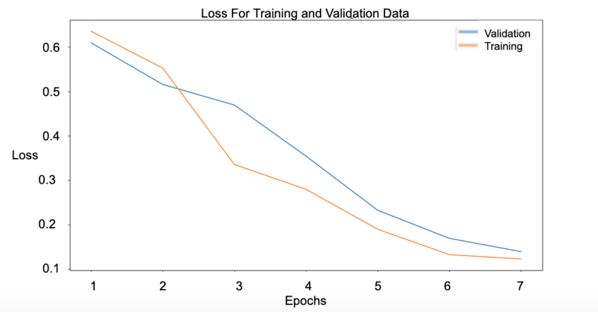

We initially embedded the words in our sample using GloVe pre-trained word embeddings. However, GloVe was trained on a corpus from Wikipedia articles prior to COVID-19 outbreak, meaning it lacked keywords related to both COVID and disinformation news articles. So, we trained our own GloVe word embeddings on a dataset provided by GDI. This dataset contains an unknown mix of positive and negative articles published in 2020 that contain the following coronavirus keywords: coronavirus, COVID, COVID-19. It  represents about ~10% of the coronavirus-keyword-containing articles collected by GDI. So although it’s much smaller than the corpus used for pre-trained GloVe embeddings, it’s still a considerable size, it has the advantage of being relevant to this topic. 

## Layers of the model

1. Embedding layer - using embedded article text (trained on COVID data)

2. Bidirectional LSTM layer - responsible for building  the context of the word embedding inputs

3. Dense layer 

4. Dropout layer - drops nodes to improve overfitting 

5. Output layer (provides classification)

## Features

We experimented with two different word embeddings - 200-dimensional and 300-dimensional GloVe layers. Article text was the only feature in this model. 
Our final test data had 7,105 samples. Of the 2,420 disinformation articles this  model correctly classified 2,268 of them. Of the 4,685 legitimate articles our model incorrectly classified 131 of them as disinformation. 

## Analysis

