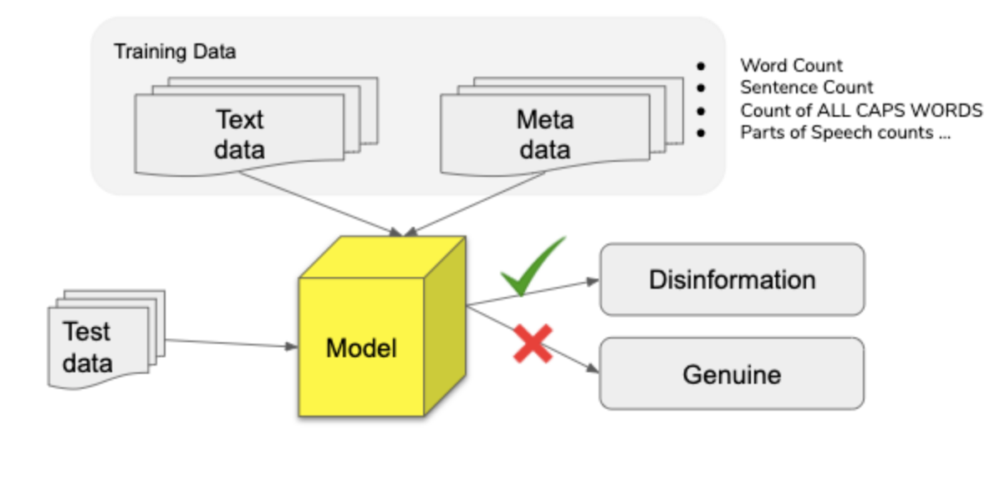

The existing literature indicates that neural networks have the greatest performance for text classification but they also don’t allow for the extraction of features since the features in such a model are hidden. Adding hand-crafted features add a greater amount of transparency about the features which have helped the model differentiate in the text classification task. Additionally, layering hand-crafted features on top of a neural network model in this way has been identified as a potential way to increase performance and an area of investigation by current neural network research on this topic.

## Features

This model aims to leverage the addition of hand-crafted lexical and semantic features to our baseline model. The following lexical and semantic features are included: 

1. Number of sentences in the article (‘sent_count')

2. Number of stopwords to total words ratio ('ratio_stops_tokens')

3. Number of words with first letter capitalized

4. Number of words with all letters capitalized

5. Parts of Speech: Adposition (in, to), adverb (very, down), auxiliary , conjunction, coordinating conjunction, determiner, interjection, noun, numeral, particle, pronoun, proper noun, punctuation, subordinating conjunction, symbol, verb, space, other (‘sdfdsf’) 

Here's what the metadata input looks like: 

```
train_meta_data = df['PROPN','ADP','NOUN','PUNCT','SYM',
              'DET','CCONJ','VERB','NUM','ADV',
              'ADJ','AUX','SPACE','X','PRON',
              'PART','INTJ','SCONJ','sent_count','ratio_stops_tokens',
              'len_first_caps','len_all_caps']].values
```

## Architecture
    
This model combines two different inputs. First, similar to the other two models, the article text was converted to word embeddings in the first layer. Next, the hand-crafted lexical and semantic features are also brought into the model as inputs in their own layer. 

```
nlp_input=Input(shape=[None]) # Input layer for text
    meta_input=Input(shape=(22,)) # Input layer for 22 linguistic feature columns
    nlp_embeddings=Embedding(params.vocab_size, params.embedding_dim)(nlp_input)
    nlp_LSTM=LSTM(params.bidir_num_filters)(nlp_embeddings) # text embeddings LSTM
    x = Concatenate()([nlp_LSTM, meta_input]) # Merge text LSTM with linguistic features
    x = Dense(dense_1_filters, activation="relu")(x)
    x = Dropout(rate=dropout_rate)(x)
    x = Dense(1, activation='sigmoid')(x) # Output layer
    model=Model(inputs=[nlp_input, meta_input], outputs=[x])
```

1. Input layers:
  The first two layers of this model simply import the two input datasets.
  
2. Embedding layer:
 Next, the article text data is fed through an embedding layer which generates the word embeddings.
 
3. Bidirectional LSTM layer:
 Next, the word embeddings produced in the previous layer are fed into the long short term memory layer of the model which further processes the context of the word embeddings in the text
4. Dense layer
5. Dropout layer:
  This dropout layer helps prevent overfitting by dropping a percentage of the neurons. The dropout rate range we tested for this model was 0.1-0.5, which corresponds to a range of 10% to 50% dropout of the neurons. 
6. Output layer:
  This layer indicates that we want a binary output of 0 or 1 with 0 indicating a prediction of legitimate and
indicating a prediction of disinformation.


