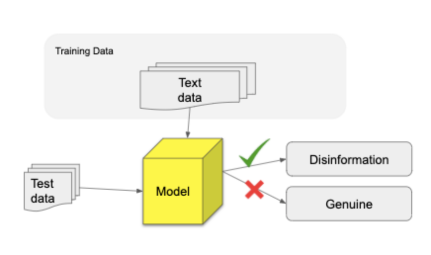
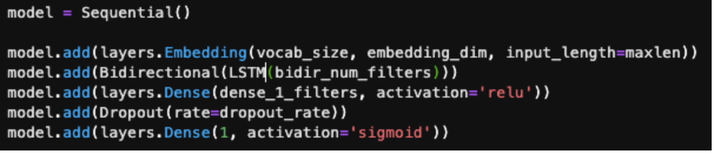
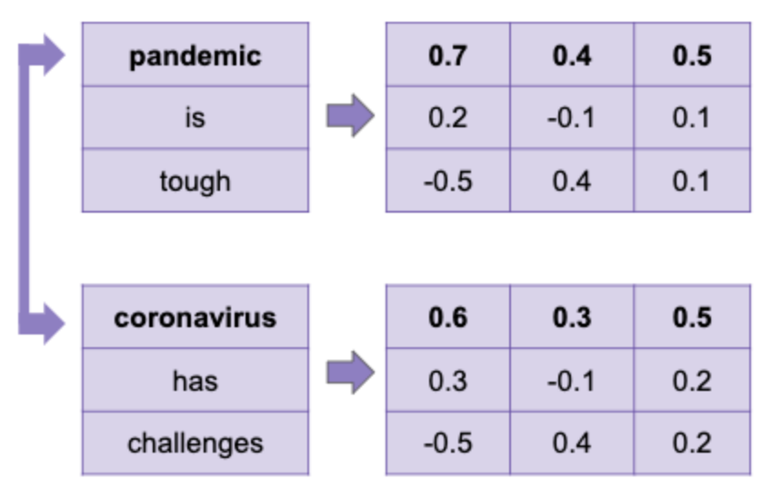
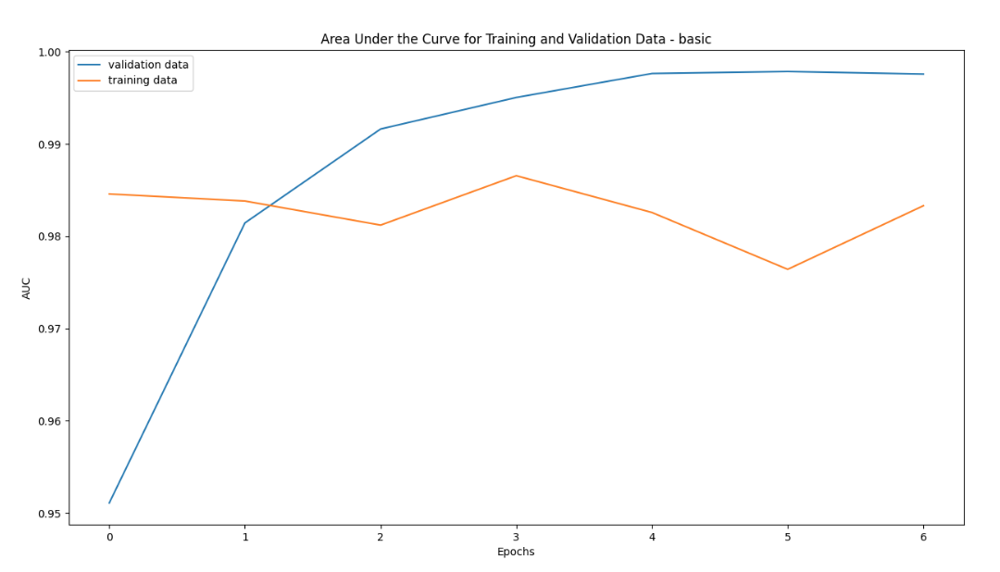
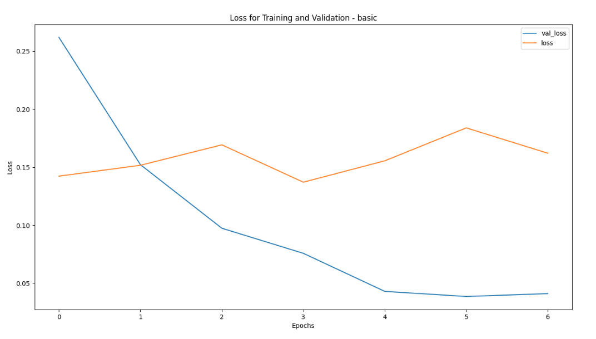
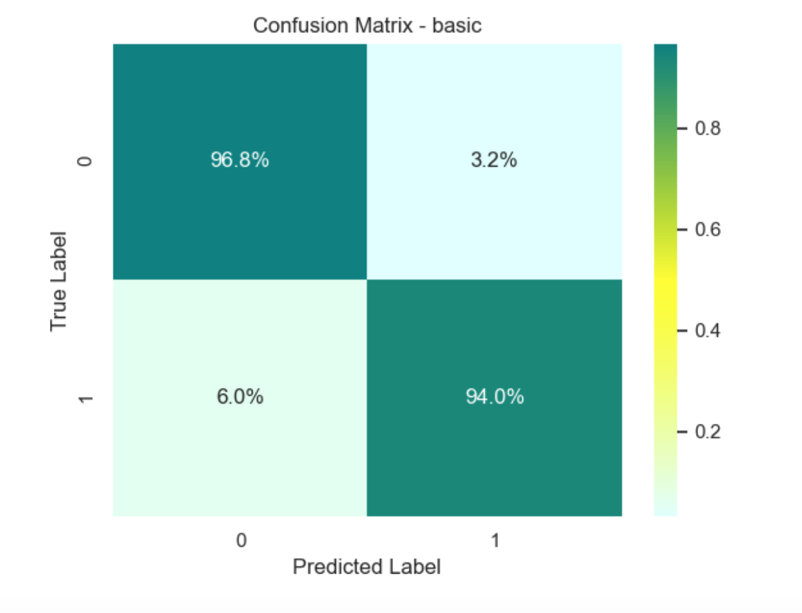

This model acts as a baseline model for the next 2 models. Model 1 is a Recurrent Neural Network LSTM (Long Short Term Memory) model which takes the article texts as input and predicts whether the article is disinformation or legitimate. The model embeds the article text as vectors which are then fed into a bidirectional LSTM layer.

This model has validation AUC (Area under the Curve) ranging from 97.6-98.6% across 7 epochs and training AUC ranging from 95.1-99.7%.

## 1. The why?
    
Methods such as Tfidf, word count frequencies are very commonly used as predictors of different categories. Our idea was to not only look at what is the        frequency of the words appearing in an article but also the context in which they appear.

For example, in the following sentence:

The <b><ins>pandemic</ins></b> has been <b><ins>tough</ins></b> on our people. While there have been some signs of recovery, <b><ins>coronavirus</ins></b> has put us in a <b><ins>challenging</ins></b> position.

We wanted to find a way to find an association between words pandemic, tough and also coronavirus and challenging because they appear in a similar context. These associations can be a very strong way to tell apart disinformation articles from legitimate articles. We decided to use the Long Short Term Memory Model to train our data.

## 2. Architecture

Layers of the model:

1. Embedding layer: 
This layer takes in the article text as input and generates word embeddings.
2. Bidirectional LSTM layer
This layer helps build the context of the word embedding inputs.
3. Dense layer
4. Dropout layer
We added a dropout layer as a method to help model avoid overfitting. The dropout rate is a number between 0 and 1. 
5. Output layer
Binary output in the form of 0 and 1. 0 if the news article is predicted as legitimate and 1 if the news article is predicted as disinformation.

## 3. Features

This model takes as input the news article text. The news article text is passed into the model after preprocessing like removing noisy characters, removing duplicates etc. You can read more about the preprocessing steps <a href="https://uwescience.github.io/DSSG2020-Disinformation/methods/">here<a>
    
The first layer of the model converts the text data into word embeddings. Word embedding is a way of converting a text corpus into an array of numbers by representing those numbers across multi-dimensional features.

Words that share similar features have vectors that are closer to each other than words that do not share similar features. The number of features is a parameter that can be chosen by passing embedding dimensions into the first layer. We used the entire training articles text to train these word embeddings.

## 4. Analysis
    
AUC - Area Under the Curve:

In our project, being aware of the imbalance in the data and the goal of the project to maximize correct identification of disinformation and minimize mislabeling of legitimate articles as disinformation we used evaluation metrics that take into account both of these constraints.

Area Under Curve is a commonly used metric when data is imbalanced. It tries to strike a balance between maximizing correct identification of disinformation and reducing mislabeling of legitimate articles. A model whose predictions are 100% wrong has an AUC of 0.0; one whose predictions are 100% correct has an AUC of 1.0.

Loss graph:

Confusion Matrix:

