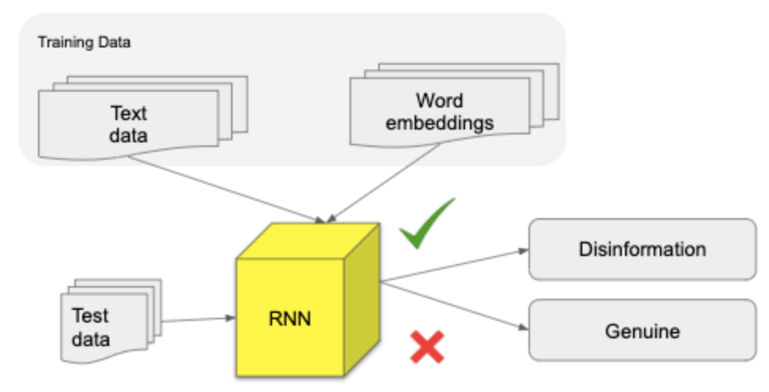
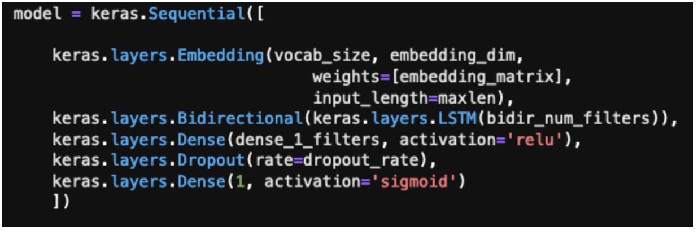
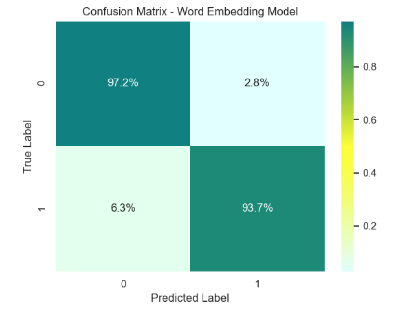

**Models**

*Model 1: Baseline Model*

This model acts as a baseline model for the next 2 models. Model 1 is a Recurrent Neural Network LSTM (Long Short Term Memory) model which takes the article texts as input and predicts whether the article is disinformation or legitimate. The model embeds the article text as vectors which are then fed into a bidirectional LSTM layer.

This model has validation AUC (Area under the Curve) ranging from 97.6-98.6% across 7 epochs and training AUC ranging from 95.1-99.7%.

    1. The why?
    
Methods such as Tfidf, word count frequencies are very commonly used as predictors of different categories. Our idea was to not only look at what is the        frequency of the words appearing in an article but also the context in which they appear.

For example, in the following sentence:

The <b><ins>pandemic</ins></b> has been <b><ins>tough</ins></b> on our people. While there have been some signs of recovery, <b><ins>coronavirus</ins></b> has put us in a <b><ins>challenging</ins></b> position.

We wanted to find a way to find an association between words pandemic, tough and also coronavirus and challenging because they appear in a similar context. These associations can be a very strong way to tell apart disinformation articles from legitimate articles. We decided to use the Long Short Term Memory Model to train our data.

    2. Architecture

Layers of the model:

1. Embedding layer: 
This layer takes in the article text as input and generates word embeddings.
2. Bidirectional LSTM layer
This layer helps build the context of the word embedding inputs.
3. Dense layer
4. Dropout layer
We added a dropout layer as a method to help model avoid overfitting. The dropout rate is a number between 0 and 1. 
5. Output layer
Binary output in the form of 0 and 1. 0 if the news article is predicted as legitimate and 1 if the news article is predicted as disinformation.

    3. Features

This model takes as input the news article text. The news article text is passed into the model after preprocessing like removing noisy characters, removing duplicates etc. You can read more about the preprocessing steps <a href="https://uwescience.github.io/DSSG2020-Disinformation/methods/">here<a>
    
The first layer of the model converts the text data into word embeddings. Word embedding is a way of converting a text corpus into an array of numbers by representing those numbers across multi-dimensional features.

Words that share similar features have vectors that are closer to each other than words that do not share similar features. The number of features is a parameter that can be chosen by passing embedding dimensions into the first layer. We used the entire training articles text to train these word embeddings.

    4. Analysis
    
AUC - Area Under the Curve:

In our project, being aware of the imbalance in the data and the goal of the project to maximize correct identification of disinformation and minimize mislabeling of legitimate articles as disinformation we used evaluation metrics that take into account both of these constraints.

Area Under Curve is a commonly used metric when data is imbalanced. It tries to strike a balance between maximizing correct identification of disinformation and reducing mislabeling of legitimate articles. A model whose predictions are 100% wrong has an AUC of 0.0; one whose predictions are 100% correct has an AUC of 1.0.

Loss graph:

Confusion Matrix:

*Model 2: Word Embeddings model (using our own trained embeddings)*

We initially embedded the words in our sample using GloVe pre-trained word embeddings. However, GloVe was trained on a corpus from Wikipedia articles prior to COVID-19 outbreak, meaning it lacked keywords related to both COVID and disinformation news articles. So, we trained our own GloVe word embeddings on a dataset provided by GDI. This dataset contains an unknown mix of positive and negative articles published in 2020 that contain the following coronavirus keywords: coronavirus, COVID, COVID-19. It  represents about ~10% of the coronavirus-keyword-containing articles collected by GDI. So although it’s much smaller than the corpus used for pre-trained GloVe embeddings, it’s still a considerable size (3 GB???), it has the advantage of being relevant to this topic. 

Layers of the model:

1. Embedding layer - using embedded article text (trained on COVID data)

2. Bidirectional LSTM layer - responsible for building  the context of the word embedding inputs

3. Dense layer 

4. Dropout layer - drops nodes to improve overfitting 

5. Output layer (provides classification)

Features:

We experimented with two different word embeddings - 200-dimensional and 300-dimensional GloVe layers. Article text was the only feature in this model. 

Analysis:

Our final test data had 7,105 samples. Of the 2,420 disinformation articles this  model correctly classified 2,268 of them. Of the 4,685 legitimate articles our model incorrectly classified 131 of them as disinformation. 

Confusion Matrix:

AUC:

Loss:

*Model 3: Multiple Input Model*

Short description:

This model aimed to leverage the addition of hand-crafted lexical and semantic features to our baseline model. These lexical and semantic features included: 

1. Number of sentences in the article (‘sent_count')

2. Number of stopwords to total words ('ratio_stops_tokens')

3. Number of words with first letter capitalized

4. Number of words with all letters capitalized

5. Parts of Speech

a. Adposition (in, to), adverb (very, down), auxiliary , conjunction, coordinating conjunction, determiner, interjection, noun, numeral, particle, pronoun, proper noun, punctuation, subordinating conjunction, symbol, verb, space, other (‘sdfdsf’) 

train_meta_data = df['PROPN','ADP','NOUN','PUNCT','SYM',
              'DET','CCONJ','VERB','NUM','ADV',
              'ADJ','AUX','SPACE','X','PRON',
              'PART','INTJ','SCONJ','sent_count','ratio_stops_tokens',
              'len_first_caps','len_all_caps']].values

    5. The why?
    
The existing literature indicates that neural networks have the greatest performance for text classification but they also don’t allow for the extraction of features since the features in such a model are hidden. Adding hand-crafted features add a greater amount of transparency about the features which have helped the model differentiate in the text classification task. Additionally, layering hand-crafted features on top of a neural network model in this way has been identified as a potential way to increase performance and an area of investigation by current neural network research on this topic.

    6. Architecture
    
This model combines two different inputs. First, similar to the other two models, the article text was converted to word embeddings in the first layer. Next, the hand-crafted lexical and semantic features are also brought into the model as inputs in their own layer. 

nlp_input=Input(shape=[None]) # Input layer for text
    meta_input=Input(shape=(22,)) # Input layer for 22 linguistic feature columns
    nlp_embeddings=Embedding(params.vocab_size, params.embedding_dim)(nlp_input)
    nlp_LSTM=LSTM(params.bidir_num_filters)(nlp_embeddings) # text embeddings LSTM
    x = Concatenate()([nlp_LSTM, meta_input]) # Merge text LSTM with linguistic features
    x = Dense(dense_1_filters, activation="relu")(x)
    x = Dropout(rate=dropout_rate)(x)
    x = Dense(1, activation='sigmoid')(x) # Output layer
    model=Model(inputs=[nlp_input, meta_input], outputs=[x]) # Final model

Layers of the multiple input model:

1. Input layers:
  The first two layers of this model simply import the two input datasets.
  
2. Embedding layer:
 Next, the article text data is fed through an embedding layer which generates the word embeddings.
 
3. Bidirectional LSTM layer:
 Next, the word embeddings produced in the previous layer are fed into the long short term memory layer of the model which further processes the context of the word embeddings in the text
4. Dense layer
5. Dropout layer:
  This dropout layer helps prevent overfitting by dropping a percentage of the neurons. The dropout rate range we tested for this model was 0.1-0.5, which corresponds to a range of 10% to 50% dropout of the neurons. 
6. Output layer:
  This layer indicates that we want a binary output of 0 or 1 with 0 indicating a prediction of legitimate and
indicating a prediction of disinformation.

7. Features:

