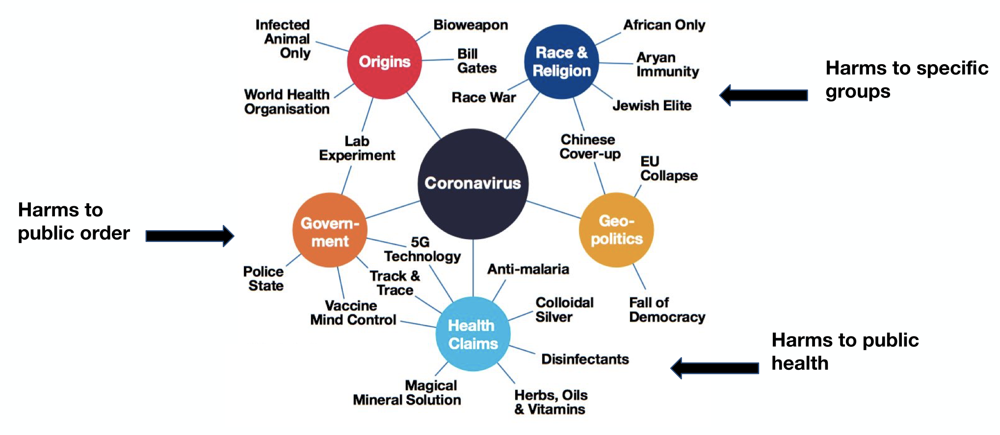
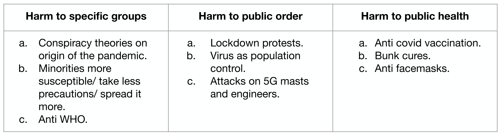

**Background**

The production and consumption of written news has changed dramatically over the past decade. Specifically, the move from predominantly print to predominantly online formats has heralded numerous new challenges. One such challenge is the proliferation of disinformation websites and the corresponding spread of unreliable, untrustworthy, or even purposefully incendiary or deceptive content. In the US and globally, this proliferation of online disinformation has eroded public trust in mainstream media, political actors, and even public health officials. 
 
In regard to the ongoing coronavirus pandemic, the deleterious impact of disinformation has and continues to be substantial. Disinformation related to the coronavirus poses a broad threat to national and global public health, particularly if individuals disregard the public health measures (e.g., socially-distancing, wearing a mask, etc.) necessary to mitigate the continued transmission of the virus. Further, this type of disinformation has also contributed to the direct loss of lives after self-administration of unproven medications promoted by online disinformation. 

Examples of coronavirus related disinformation narratives:

*Source: https://disinformationindex.org/wp-content/uploads/2020/07/GDI_Ad-funded-COVID-19-Disinformation-1.pdf*

Examples of possible harms of coronavirus related disinformation narratives:

*Source: https://disinformationindex.org/wp-content/uploads/2020/07/GDI_Ad-funded-COVID-19-Disinformation-1.pdf*

Our partner organization, **The Global Disinformation Index (GDI)**, is already engaged in work to identify and defund disinformation on the internet. Their current focus involves identifying disinformation websites via a system of scoring the degree of disinformation risk at the domain-level.

To this end, GDI under the general guidance of the Technical Advisory Group[1], has developed and piloted an index that provides disinformation risk ratings for news sites in media markets across the globe. It is intended to help brands and ad tech firms have more transparent and trusted information about the news sites where they place ads, allowing them in principle to make more informed decisions about where ads are served, based on their own self-determined risk thresholds.You can read more about how GDI computes this index [here](https://disinformationindex.org/the-index/). 

This DSSG project was focused on addressing online disinformation related to coronavirus. In collaboration with GDI, we produced a neural network model that accurately classified articles as disinformation or not. This work may be generalized to other substantive domains or to disinformation more broadly. Our goal was to add transparency to the process by which brands and advertisers fund disinformation. The existing tools used by advertisers, such as blocking websites based on the presence of certain keywords, is blunt. Accordingly, we wanted to build a tool that could inform the advertisers and brands to pull their ads from disinformation websites with greater specificity than relying on blocking keywords. Our approach provided greater specificity and granularity that not only improved precision of targeting disinformation sites but also added the protection of profitability for legitimate news which are currently being blocked based on keyword parameters. This will limit the profitability of disinformation websites.

 
**Questions**

1. What distinguishes disinformation and legitimate news online?

2. What methods can be used to automate classification of online news content as legitimate or disinformation?

3. What preprocessing steps are necessary to enable the success of a classification model which depends on natural language processing methods?

4. How can a machine learning model be built to detect disinformation in a perpetually evolving landscape of disinformation narratives? 

**Stakeholders**

There were several direct and indirect stakeholders to this project. The direct stakeholders were involved in the early stages of developing the models and the indirect stakeholders were those who might be affected by the operation of the model or engage with it at later stages. Our team worked closely with the following direct stakeholders:
 
* **Global Disinformation Index (GDI)**: GDI works with governments, businesses and civil society to defund and down-rank disinformation websites. They have built various classifiers to support detection of disinformation in news articles. GDI’s Maggie Engler (Lead Data Scientist) and Lucas Wright (Senior Researcher) are the project leads.
 
* **University of Washington eScience Institute**: This project was part of the Data Science for Social Good (DSSG) program hosted by the e-Science Institute at the University of Washington. The eScience Institute provided resources including key personnel such as the administrative team and the data scientists (Noah Benson and Vaughn Iverson).
 
* **Data Science for Social Good Fellows**: This group of stakeholders consist of students from different universities who are working as interns. The fellows are working directly with project lead and data scientists to develop the model.

* **Ad exchange companies**: Ad exchange companies may use the model we've produced to identify articles that have disinformation or inform their current machine learning models in this domain.

Indirect stakeholders are individuals who will be affected by the model after release: they are not directly involved during the initial design process of the model. After the model is released, GDI will continue to work with indirect stakeholders. Meanwhile, the indirect stakeholders of this project are:
 
* **Global Alliance for Responsible Media (GARM)**: GARM brings together advertisers, agencies, media companies, platforms and industry organizations to improve public safety. GDI will deliver the model to GARM to be shared with other stakeholders within GARM.
 
* **Data scientists and researchers**: The model will be open source and it will be available on GitHub for other data scientists and researchers to access it and use it in their research projects.

**Ethics**

The primary ethical considerations of this project were:

* **Erroneously labeling a legitimate article as disinformation**
There is a possibility that the model might automatically label a “legitimate” article as “disinformation” because it covered a topic which is about disinformation. In such a situation, the model might harm the reputation of the authors, publishers, or website associated with that article.

At the heart of this problem lies the difficulty of measuring the extent of disinformation in a given article. Are there half-truths present? And does the article mostly contain factual information save for a couple of sentences? Any tool built to automatically classify articles as disinformation then needs to make a trade-off between truthful and disinformation content. 

* **Possible misuse of our end product**
Also, due to the open-source nature of this project, it is possible that groups invested in the creation and propagation of digital disinformation may utilize our code and documentation in order to produce content which would escape detection in our final model.

Publicly labelling an article as “disinformation” must be supported by substantial evidence and rigorous protocols which might be lacking in some of the machine learning models that the team decides to use. The model will also be limited by the nuances of the training data.

We have taken the following steps to address these ethical concerns:

* Detailed documentation of model development and use

Besides being a good general practice, detailed documentation of the process allows the user aware of the blindspots of the model. 

Good documentation also assisted the team in laying out their assumptions and identifying the inherent biases the team might have built into the model.

* Sharing the metrics/ criterion used

What is the predicted probability that an article is disinformation/legitimate? What are the hyper-parameters being used by the model? What should be the accuracy of the model to qualify as the chosen model? These and more questions about metrics, if answered, help the user validate the work being done.

* Building model alternatives and performing cross-model-validation

The team built a variety of models and performed their validation tests to make an informed decision about the final model. The assessment of a model against the suitability and context of the problem helped further reduce subjectivity around the outcomes.

---

[1] Index members include  Camille François (Graphika) and Dr. Scott Hale (Meedan/Oxford Internet Institute), Olaf Steenfadt (Reporters without Borders/Journalism Trust Inititiave), and Cristina Tardáguila (International Fact Checking Network/Poynter),
