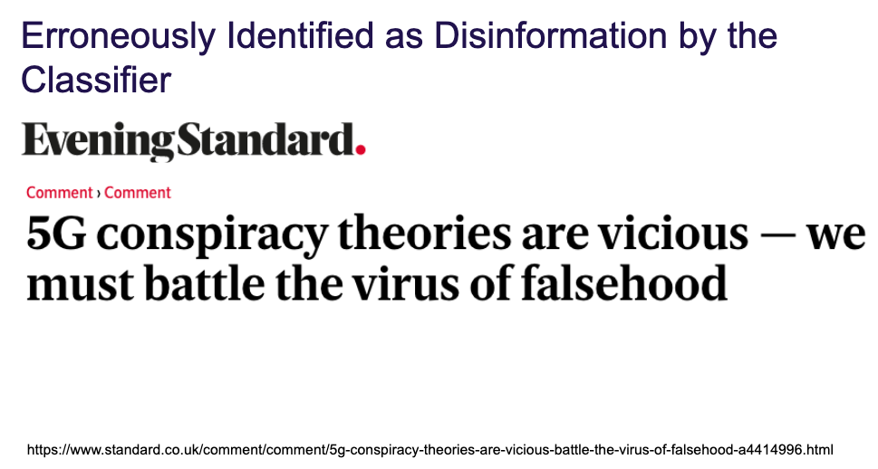
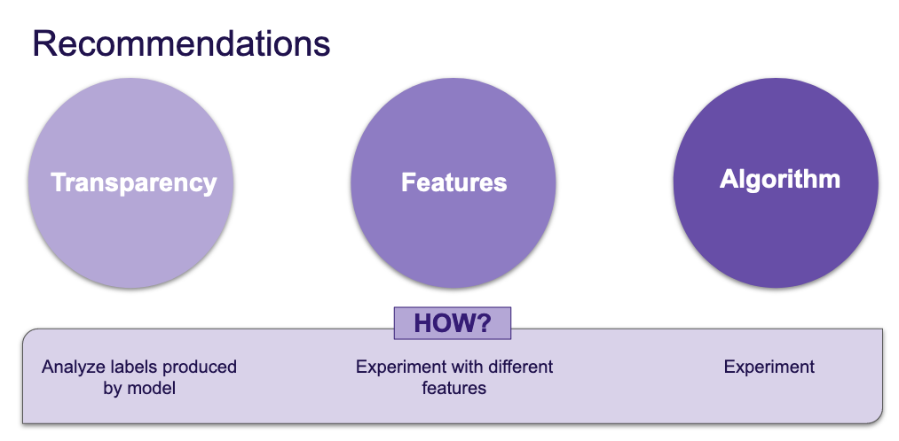
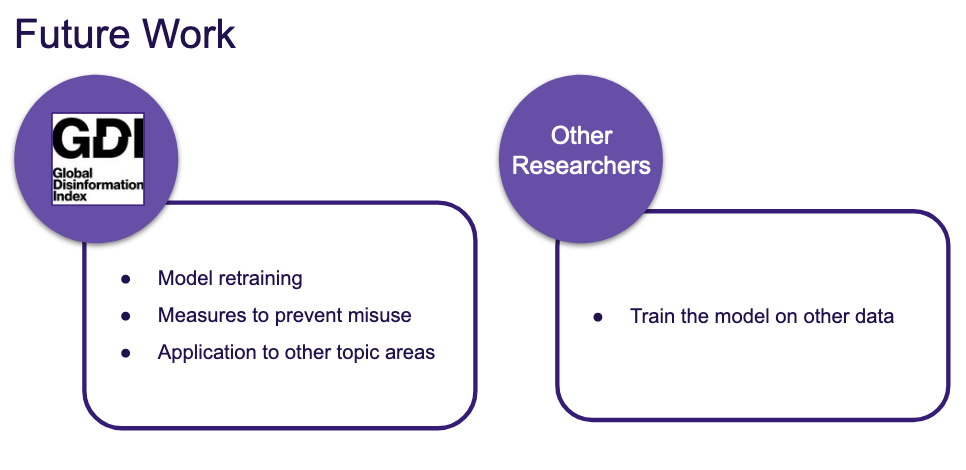

We were able to run a total of three models using different combinations of hyperparameters, features and architectures. For models that relied exclusively on word embedding features (Model 1 (LSTM) and Model 2 (LSTM + Our Own Trained Embeddings)), we used GridSearchCV to test a total of 72 hyperparameter combinations (see *Table 1* below) and ran each model for 7 epochs to assess learning and validation rates (refer to individual model tabs to see the graphs for respective models). We also used stratified cross validation with 5 folds with Models 1 and 2 to avoid overfitting. For running the Multiple Inputs model, we were not able to utilize GridSearchCV. However, we manually ran the model with a set of hyperparameters. 

*Table 1 - Hyperparameters Tested*

| Hyperparameter | Range of Values Tested | 
| :----        |    :----:   |  
| Number of filters in BiDirectional LSTM Layer   |  32, 64, 128   |      
| Number of filters in hidden layer |     10    |         
| Vocabulary Size |   10,000      |         
| Embedding Dimensions |   100, 200, 300  |      
| Maximum Length|   681      |      
| Dropout Rate|   0.2, 0.3, 0.4, 0.5     |     
| Optimizer|   adam, nadam     | 

*Table 2* contains the two main metrics we used to evaluate model performance - percentage of correctly predicted disinformation articles (True Positives) and percentage of incorrectly predicted legitimate articles (False Positives). For Model 1, of the 2,420 disinformation articles in our test dataset it correctly classified 2,274 of them. That’s a 93.7% correct prediction rate. Of the 4,685 legitimate articles our model incorrectly classified 149 of them as disinformation, or 3.2%.For Model 2, of the 2,420 disinformation articles in our test dataset it correctly classified 2,268 of them. That’s a 93.7% correct prediction rate. Of the 4,685 legitimate articles our model incorrectly classified 131 of them as disinformation, or 2.8%. 

Overall, Model 1 and Model 2 have nearly identical rates of predicting true positives, although Model 1 does slightly better with 94% compared to 93.7%. Similarly, the two models are not too far off when it comes to prediction rate for false positives. However, Model 2 performs slightly better in terms of incorrectly classifying legitimate news - at 2.8% vs. 3.2%. 

*Table 2 - Model Performance Metrics*

| Model Name | True Positives* | False Positives* | 
| :----       |    :----:   |  :----: |
| Model 1 - LSTM   |  94%   |  3.2%   |      
| Model 2 - LSTM+COVID-trained word Embeddings|    93.7%   |  2.8%   |      

*True Positives: Disinformation articles that were correctly predicted as disinformation by the model.*
*False Positives: Legitimate articles that were incorrectly predicted as disinformation by the model.*

Although we didn’t have the bandwidth to fully and thoroughly analyze false positives, one theory we had about why both models are still misclassifying legitimate articles is because some of them talk about disinformation. We did find one article in the False Positives results to support this theory: 

Since access to accurate information is essential for people to navigate through the health crisis we are living through, we want the final model to have as low of a false positive rate as possible, while achieving a true positive rate of at least 93%. Given the slightly lower rate of False Positives rate for Model 2, we would suggest that using an LSTM model with embeddings trained on COVID corpus be used instead of Model 1.

**Interpretation**

Our findings demonstrate that RNN models do indeed work well for classification of article texts in the context of COVID disinformation. Training word embeddings on a separate stand-alone corpus containing COVID keywords did offer a slightly better performance in terms of lowering the False Positives rate. The rate of prediction of True Positives, however, was slightly lower. 

It’s also important to reiterate that the purpose of an RNN-based classifier  is not to be a stand-alone tool, but rather to be deployed in conjunction with human review. The model prototypes we’ve built seem to be very promising in terms of their ability to greatly reduce the workload on domain experts who are trying to combat disinformation through time-consuming manual review. Human intervention is central to the success of this model. But we hope that when deployed in conjunction with human review, we can minimize disincentive of legitimate articles that talk about disinformation narratives. 

Neural Networks are often criticized for the ‘black box problem’. The question of neural network interpretability is under much discussion and scrutiny at the moment and it’s a very active area of research. This is something that should be taken into account. Area of further development of this model in the future. 

Using more features- metadata, other types of embeddings, etc. Both Model 1 and 2 used article text as input, whereas Model 3 used linguistic features as well. We did not have the bandwidth to fine-tune Model 3, but we expect the classifier to improve in terms of performance with more features in place. We also think that doing a network analysis of urls embedded in individual article text would be helpful in the task of classification as we suspect that disinformation news link to other disinformation news at a much higher rate than legitimate news. 

In this project, we tested a limited number of model architectures and hyperparameters. There are many more different combinations that could be tested to see if the classifier can be improved and we encourage  such further experimentation. 

**Artifacts** 

In addition to the three models we’ve developed, we have also created the following artifacts which can be useful for further exploration and research. 

*Trained embeddings (news articles with COVID keywords)*

Working with text data requires that it is not only processed in accordance with standard natural language processing principles (standardizing, normalizing) but that it is also converted into a mathematical representation which then allows for more advanced machine learning. As described in the Methods section, word embeddings allow for such a transformation of text. There are many pre-trained word embeddings that are available to researchers (GloVe, Word2Vec). However, based on discussions with GDI and our data science team we chose to train our own GloVe embeddings on a subset of articles provided by GDI. This corpus was not part of our training dataset, and besides training word embeddings was not used for any other purpose. We produced a 300 dimension word embedding tailored to COVID keywords which we think could be very useful to future research. 

*Reading List*

Throughout this project, our team relied heavily on literature review to inform our methodology. Our focus was on surveying the most recent literature on article classification with machine learning. We’ve read a total of 34 papers and have made the list of these papers available in the public repository. This document serves as a guidepost for our thinking process, assumptions as well as framework within which this project took place. This might prove a useful guide for others as well. 

We hope that the deliverables will be used to design a larger model which will be able to provide disinformation indexes for news websites. Such an index can inform advertisers about the “health” of a news website and thereby stopping advertising content on “unhealthy” websites. We created and tested our models with the intention of the best one being useful to GDI as well as other researchers working in the space of disinformation. Going forward in developing the prototypes further, the following could prove useful: 

*Model Retraining*
Because disinformation narratives change very rapidly, it will be important to retrain the classifier periodically on most recent data. It will also be important to determine how often the model needs to be retrained with new data. 

*Measures to Prevent Misuse*
Any kind of classifier can be misused. We fully rely on GDI to place measures to prevent such misuse in the final iteration of this tool if used. 

*Application to Other Areas*
Lastly, GDI might find this model prototype useful for classification in other topic areas, and make our recommended model generalizable to other disinformation topics (besides COVID19) 

*Other researchers*
By making this an open-source model, we hope other researchers will be able to use our model as a guide in their projects. 

**Anticipated Impact**

Accurate, reliable, and timely health information is critical to combating any large-scale health emergency, such as the current and ongoing coronavirus pandemic. In February of 2020, the Director-General of the World Health Organization, Tedros Adhanom Ghebreyesus, famously said, [“We’re not just fighting an epidemic; we’re fighting an infodemic.”] (https://www.un.org/en/un-coronavirus-communications-team/un-tackling-‘infodemic’-misinformation-and-cybercrime-covid-19) An infodemic refers to the proliferation of information about a topic so that the realm is flooded by both real and fake information and one may have trouble locating reliable and evidence-based information. While disinformation continues to be a problem that plagues the internet, it has been particularly dangerous in an era when people need access to critical health and prevention guidance. In the United States, the coronavirus pandemic has shown no signs of abating and, instead, has increased in intensity with many states experiencing new records in cases, hospitalizations, and deaths. Some of this spread and other adverse outcomes, even some deaths, have resulted from coronavirus disinformation. 

As such, the importance of continuing to disarm and defund disinformation efforts as well as increase public awareness of the corresponding “infodemic” about coronavirus. Our work in this project added to the field by developing a long short term memory (LSTM) recurrent neural network model by which to classify news websites as disinformation versus not. We anticipate that this work will be utilized by our partner organization, Global Disinformation Index, by informing their current model as well as future model development. Additionally, other researchers and organizations studying disinformation may also find our model and documentation useful as res Specifically, our classifier model may be adapted as the pandemic continues or reworked to address disinformation surrounding the upcoming election in November 2020, in the United States.

In terms of educating the wider public, we presented our findings at the end of the Data Science for Social Good Program in a talk that was open to the public and attended by key stakeholders. Additionally, we hope to consolidate and summarize our findings into a manuscript for publication in a high impact, peer-reviewed journal and/or one or more conference presentations in the coming months in order to disseminate the model we’ve developed and the knowledge that we’ve accumulated from the extant literature, exploration of our coronavirus corpus, and from key domain experts.

